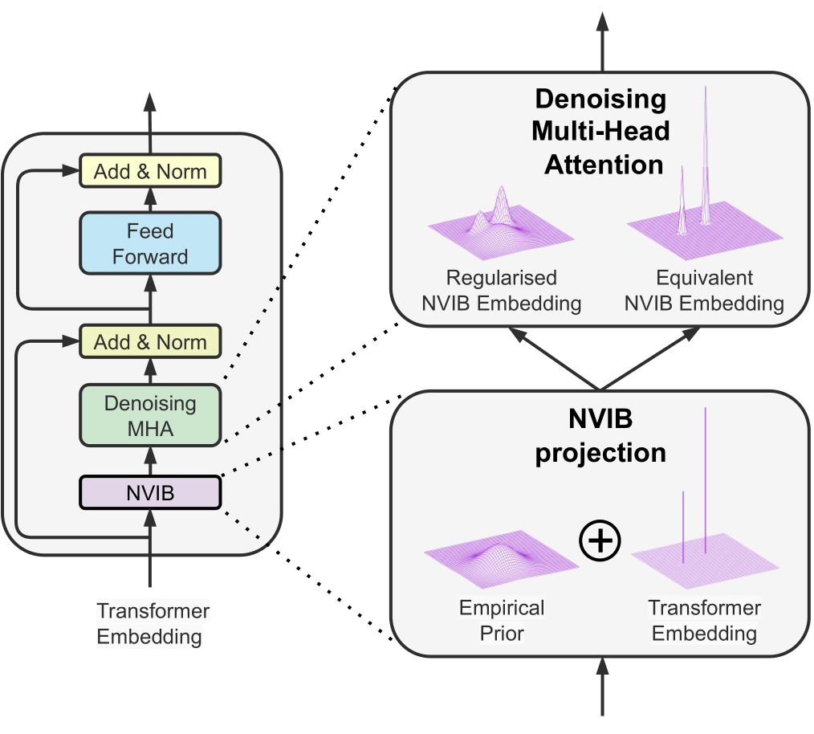

..
.. SPDX-FileCopyrightText: Copyright © 2024 Idiap Research Institute <contact@idiap.ch>
..
.. SPDX-FileContributor: Fabio J Fehr <fabio.fehr@idiap.ch>
..
.. SPDX-License-Identifier: GPL-3.0-only
..

================================================================================================================
Nonparametric Variational Regularisation  of Pretrained Transformers
================================================================================================================

.. TODO: Back up the best models. The best models are in just on the wandb server.
.. Check out the sweeps of hyperparms_improved (Summarisation) and translation_nvib
.. (Translation) for the best models.

This repository contains the code developed for the paper
`Nonparametric Variational Regularisation  of Pretrained Transformers <https://openreview.net/forum?id=Zu8OWNUC0u#discussion>`_ (COLM2024).

Please cite the original authors for their work in any publication(s) that uses this work:

.. code:: bib

    @inproceedings{
        fehr2024nonparametric,
        title={Nonparametric Variational Regularisation of Pretrained Transformers},
        author={Fabio James Fehr and James Henderson},
        booktitle={First Conference on Language Modeling},
        year={2024},
        url={https://openreview.net/forum?id=Zu8OWNUC0u}
    }

Installation
------------

To create a new conda/mamba environment, install conda_, then mamba_, and simply follow the next steps:

.. code:: bash

    mamba env create -f environment.yml   # Create environment
    mamba activate nvr                    # Activate environment

*NB* This environment also installs the nvib package which is assumed to be in a directory one level above the current directory.

Pytests
~~~~~~~~~~

We conduct sanity tests of equivalence between the original model and the
NV model. To run the tests, simply run the following command:

.. code:: bash

    pytest

These should hopefully pass. If they do not we know we have broken something.

Experiments
-------------------

For the experiments we evaluate on summarisation and translation tasks.
We first calculate an empirical prior of the latent representations of the
model on the fine-tuning data. We then evaluate the model on the summarisation
and translation tasks with different data forming our out-of-domain (OOD)
experiments.

For a specific task:

1. Calculate empirical priors on the fine-tuning data
2. Run the original baseline model
3. Run the NVIB model for equivalence with the baseline
4. Run a sweep for hyperparameter tuning for NVIB only using forward passes.

Empirical Priors
~~~~~~~~~~~~~~~~~~~~~~

The NVIB models use an empirical prior for the latent representations.
We create the empirical prior for the models by using the data on which they
are fine-tuned. This can be done with limited data but is only calculated once.

For example, to create the empirical prior for the BART-LARGE-XSUM model,
which is then used by the NVIB model, we use the xsum data and run the
following command:

.. code:: bash

    python empirical_prior.py --model BART-LARGE-XSUM --project_name project_name --data xsum
.. python empirical_prior.py --model BART-LARGE-CNN --project_name project_name --data cnn_dailymail

For the translation models, we use the opus100 data and run the following command:

.. code:: bash

    python empirical_prior.py --model MARIAN --project_name project_name --data opus100 --src_lang en --tgt_lang fr
.. python empirical_prior.py --model MARIAN --project_name project_name --data opus100 --src_lang en --tgt_lang de

Note: We can create the empirical priors with limited data using the
`--train_perc` flag with a value between 0 and 1. You can also  set the
`--batch_size` to accomodate for your memory.

Summarisation
~~~~~~~~~~~~~~~~~~~~~~~~~~~~

For each dataset we initially run the
original baseline model. This allows for a comparison with the NVIB model.
We then run the NVIB model for equivalence with the baseline.

To run the original baseline model run the following command:

.. code:: bash

    python evaluate_summarisation.py --model BART-LARGE-XSUM --project project_name --experiment_name baseline_BART-LARGE-XSUM_xsum --data xsum
.. python evaluate_summarisation.py --model BART-LARGE-XSUM --project project_name --experiment_name baseline_BART-LARGE-XSUM_cnn_dailymail --data cnn_dailymail
.. python evaluate_summarisation.py --model BART-LARGE-XSUM --project project_name --experiment_name baseline_BART-LARGE-XSUM_curation --data curation
.. python evaluate_summarisation.py --model BART-LARGE-XSUM --project project_name --experiment_name baseline_BART-LARGE-XSUM_wikihow --data wikihow
.. python evaluate_summarisation.py --model BART-LARGE-XSUM --project project_name --experiment_name baseline_BART-LARGE-XSUM_samsum --data samsum

.. python evaluate_summarisation.py --model BART-LARGE-CNN --project project_name --experiment_name baseline_BART-LARGE-CNN_xsum --data xsum
.. python evaluate_summarisation.py --model BART-LARGE-CNN --project project_name --experiment_name baseline_BART-LARGE-CNN_cnn_dailymail --data cnn_dailymail
.. python evaluate_summarisation.py --model BART-LARGE-CNN --project project_name --experiment_name baseline_BART-LARGE-CNN_curation --data curation
.. python evaluate_summarisation.py --model BART-LARGE-CNN --project project_name --experiment_name baseline_BART-LARGE-CNN_wikihow --data wikihow
.. python evaluate_summarisation.py --model BART-LARGE-CNN --project project_name --experiment_name baseline_BART-LARGE-CNN_samsum --data samsum

It is important to keep the naming convention for each dataset consistent: `baseline_[MODEL]_[DATA]` run this for each dataset.
If we want to get an equivalence with the NVIB model we can run the following command:

.. code:: bash

    python evaluate_summarisation.py --model NVIBBART-LARGE-XSUM --project project_name --experiment_name NVIBBART-LARGE-XSUM_xsum --data xsum  --emp_data xsum --alpha_tau_e 10 --alpha_tau_c 10 --alpha_tau_d 10 --stdev_tau_e 0 --stdev_tau_c 0 --stdev_tau_d 0

We should notice that the model is using the empirical prior, it should print the `Loading empirical distribution from: ...`.
We should also notice that if initialised with equivalence we should get the same results as the baseline model. We should also
see that the rouge overlap with the baseline model is 100\%.

Now lets apply some post-training regularisation and see how the model performs:

.. code:: bash

    python evaluate_summarisation.py --model NVIBBART-LARGE-XSUM --project project_name --experiment_name NVIBBART-LARGE-XSUM_xsum_new --data xsum  --emp_data xsum --alpha_tau_e -3 --alpha_tau_c -7 --alpha_tau_d 2 --stdev_tau_e 0.35 --stdev_tau_c 0.10 --stdev_tau_d 0.20

Translation
~~~~~~~~~~~~~~~~~~~~~~~~~~

For each dataset we initially run the
original baseline model. This allows for a comparison with the NVIB model.
We then run the NVIB model for equivalence with the baseline.

To run the original baseline model run the following command:

.. code:: bash

    python evaluate_translation.py --model MARIAN --project_name project_name --experiment_name baseline_MARIAN_opus100_enfr --data opus100 --src_lang en --tgt_lang fr
.. python evaluate_translation.py --model MARIAN --project project_name --experiment_name baseline_MARIAN_bible_para_enfr --data bible_para --src_lang en --tgt_lang fr
.. python evaluate_translation.py --model MARIAN --project project_name --experiment_name baseline_MARIAN_iwslt2017_enfr --data iwslt2017 --src_lang en --tgt_lang fr
.. python evaluate_translation.py --model MARIAN --project project_name --experiment_name baseline_MARIAN_ted_talks_iwslt_enfr --data ted_talks_iwslt --src_lang en --tgt_lang fr

.. python evaluate_translation.py --model MARIAN --project project_name --experiment_name baseline_MARIAN_opus100_ende --data opus100 --src_lang en --tgt_lang de
.. python evaluate_translation.py --model MARIAN --project project_name --experiment_name baseline_MARIAN_bible_para_ende --data bible_para --src_lang en --tgt_lang de
.. python evaluate_translation.py --model MARIAN --project project_name --experiment_name baseline_MARIAN_iwslt2017_ende --data iwslt2017 --src_lang en --tgt_lang de
.. python evaluate_translation.py --model MARIAN --project project_name --experiment_name baseline_MARIAN_ted_talks_iwslt_enfr --data ted_talks_iwslt --src_lang en --tgt_lang de

It is important to keep the naming convention for each dataset consistent: `baseline_[MODEL]_[DATA]` run this for each dataset.
If we want to get an equivalence with the NVIB model we can run the following command:

.. code:: bash

    python evaluate_translation.py --model NVIBMARIAN --project_name project_name --experiment_name NVIBMARIAN_opus100_enfr --data opus100 --src_lang en --tgt_lang fr --alpha_tau_e 10 --alpha_tau_c 10 --alpha_tau_d 10 --stdev_tau_e 0 --stdev_tau_c 0 --stdev_tau_d 0

We should notice that the model is using the empirical prior, it should print the `Loading empirical distribution from: ...`.
We should also notice that if initialised with equivalence we should get the same results as the baseline model. We should also
see that the BLEU and Rouge overlap with the baseline model is 100\%.

Now lets apply some post-training regularisation and see how the model performs:

.. code:: bash

    python evaluate_translation.py --model NVIBMARIAN --project_name project_name --experiment_name NVIBMARIAN_opus100_enfr_new --data opus100 --src_lang en --tgt_lang fr --emp_data opus100 --alpha_tau_e 1 --alpha_tau_c 0 --alpha_tau_d 3 --stdev_tau_e 0 --stdev_tau_c 0.3 --stdev_tau_d 0

Sweeps for Hyperparameter Tuning
~~~~~~~~~~~~~~~~~~~~~~~~~~~~~~~~~~

To run the sweeps for hyperparameter tuning we need to create a sweep config file.
For the experiments of the paper we used the sweep config files in `sweep_configs/`.

.. code:: bash

    python sweep.py --config_path "sweep_configs/sweep_config_xsum.yml"

Once initialised the same command will add more runs to the sweep. In these experiemnts we
explored between 50-100 forward pass samples for the hyperparameter tuning.

Repository Structure
-----------------------------

.. code:: bash

    .
    ├── data
    ├── data_modules
    │   ├── SummarisationDataModule.py
    │   └── TranslationDataModule.py
    ├── empirical_prior.py
    ├── environment.yml
    ├── evaluate_summarisation.py
    ├── evaluate_translation.py
    ├── LICENSES
    │   └── GPL-3.0-only.txt
    ├── models_hf
    │   ├── modeling_attn_mask_utils.py
    │   ├── modeling_bart.py
    │   └── modeling_marian.py
    ├── models_nvib
    │   ├── modeling_nvibbart.py
    │   ├── modeling_nvibmarian.py
    │   └── modeling_nviboutputs.py
    ├── models_pl
    │   ├── bart_lightning.py
    │   ├── marian_lightning.py
    │   ├── nvibart_lightning.py
    │   ├── nvibmarian_lightning.py
    │   └── seq2seq_lightning.py
    ├── outputs
    ├── README.rst
    ├── sweep_configs
    │   ├── sweep_config.yaml
    │   └── ...
    ├── sweep.py
    ├── tests
    │   ├── __init__.py
    │   ├── test_nvib_bart_full.py
    │   └── test_nvib_marian.py
    └── utils.py

Contact
---------
For questions or reporting issues to this software, kindly the author_.

.. _author: fabio.fehr@idiap
.. _conda: https://conda.io
.. _mamba: https://mamba.readthedocs.io/en/latest/installation.html#existing-conda-install
.. _paper1: https://openreview.net/forum?id=6QkjC_cs03X
.. _paper2: https://arxiv.org/abs/2312.00662
